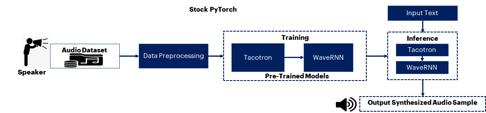

PROJECT NOT UNDER ACTIVE MANAGEMENT

This project will no longer be maintained by Intel.

Intel has ceased development and contributions including, but not limited to, maintenance, bug fixes, new releases, or updates, to this project.  

Intel no longer accepts patches to this project.

If you have an ongoing need to use this project, are interested in independently developing it, or would like to maintain patches for the open source software community, please create your own fork of this project.  

Contact: webadmin@linux.intel.com
# Applications of Synthetic Voice/Audio Generation Using PyTorch
## Introduction
Synthetic voice is a computer-generated speech. [More Info](https://en.wikipedia.org/wiki/Speech_synthesis)
## Table of Contents 
 - [Purpose](#purpose)
 - [Reference Solution](#reference-solution)
 - [Reference Implementation](#reference-implementation)

## Purpose
With the surge in AI implementation in modern industrial solutions, the demand for datasets has increased significantly to build robust and reliable AI models. The challenges associated with data privacy and higher cost of purchasing real datasets, limited data availability, accuracy of data labeling, and lack of scalability and variety, is driving the use of synthetic data to fulfill the high demand for AI solutions across industries.

Synthetic voice has wide applications in virtual assistants, education, healthcare, multimedia and entertainment. Text-to-Speech (TTS) is one method of generating synthetic voice. It creates human speech artificially. One of the main benefits of voice synthesis is to make information easily accessible to a wider audience. For example, people with visual impairments or reading disabilities can use this technology to read aloud the written content. This can help differently-abled people access a wider range of information and communicate more easily with others.

Voice synthesis technology is increasingly used to create more natural-sounding virtual assistants and chatbots, which can improve the user experience and engagement through personalized communication based on voice and language preferences.

TTS is changing in a variety of ways. For example, voice cloning can capture your brand essence and express it through a machine. Speech cloning allows you to use TTS in conjunction with voice recording data sets to combine the voices of known persons such as executives and celebrities, which can be valuable for businesses in industries such as entertainment.
## Reference Solution  
AI-enabled synthetic voice generator aid helps generate voice using simple text generator context/story as input and provides a pure system-generated synthetic voice.

The goal of this reference kit is to translate the input text data into speech. A transfer learning approach is performed on advanced PyTorch-based pre-trained Tacotron and WaveRNN (VOCODER) models. This model combination is known to be a promising method to synthesize voice data from the corresponding input text data. The LJ Speech dataset, after pre-processing using NumPy, is used for further training the mentioned pre-trained models. From the input text data, the model generates speech that mimics the voice of the LJ speech dataset which was used to train the AI model.

Since GPUs are typically the choice for deep learning and AI processing to achieve a higher performance rate, to offer a more cost-effective option leveraging a CPU, the quantization technique can be used, leveraging the Intel® Analytics toolkit, to achieve higher performance rate by performing vectorized operations on CPUs itself.

By quantizing/compressing the model (from floating-point to integer model), while maintaining a similar level of accuracy as the floating-point model, demonstrated efficient utilization of underlying resources when deployed on edge devices with low processing and memory capabilities

## Reference Implementation
### Use Case End-To-End flow


**Description:** An open-source LJ Speech voice dataset is first preprocessed with NumPy before being used to train an advanced pre-trained Tacotron and WaveRNN (VOCODER) models with Stock PyTorch v1.13.0. Following training, the trained Stock PyTorch v1.13.0 model is used to generate synthetic voice data from the input text sentence.

### Expected Input-Output


|               **Input**               |   **Output**   |
|:-------------------------------------:|-----|
| Text Sentence |  Synthesized Audio data  |


### Reference Sources

*DataSet*: https://data.keithito.com/data/speech/LJSpeech-1.1.tar.bz2 (2.6 GB dataset for this use case)<br>
*Case Study & Repo*: https://github.com/fatchord/WaveRNN 

> ***Please see this data set's applicable license for terms and conditions. Intel®Corporation does not own the rights to this data set and does not confer any rights to it.***

### Repository clone and Anaconda installation

```
git clone https://github.com/oneapi-src/voice-data-generation
cd voice-data-generation
```

> **Note**: If you are beginning to explore the reference kits on client machines such as a windows laptop, go to the [Running on Windows](#running-on-windows) section to ensure you are all set and come back here

> **Note**: The performance measurements were captured on Xeon based processors. The instructions will work on WSL, however some portions of the ref kits may run slower on a client machine, so utilize the flags supported to modify the epochs/batch size to run the training or inference faster. Additionally performance claims reported may not be seen on a windows based client machine.

> **Note**: In this reference kit implementation already provides the necessary conda environment configurations to setup the software requirements. To utilize these environment scripts, first install Anaconda/Miniconda by following the instructions at the following link  
> [Anaconda installation](https://docs.anaconda.com/anaconda/install/linux/)

### Usage and Instructions

Below are the steps to reproduce the benchmarking results given in this repository
1. Creating the execution environment
2. Dataset preparation
3. Training Tacotron & WaveRNN models
4. Evaluation
5. Model Inference

### Software Requirements
| **Package**              | **Stock Python**                   
|:-------------------------| :---                               
| Python                   | python==3.8.15                      
| PyTorch                  | torch==1.13.0                 

### Environment
Below are the developer environment used for this module on Azure. All the observations captured are based on these environment setup.


| **Size** | **CPU Cores** | **Memory** | **Intel® CPU Family** |
|----------|:-------------:|:----------:|:---------------------:|
|    NA    |       8       |    32GB    |        ICELAKE        |

### Solution setup
The below file is used to create an environment as follows:


|     **YAML file**     | **Environment Name** |            **Configuration**            |
|:---------------------:|----------------------|:---------------------------------------:|
| `env/stock/stock-voice.yml` | `stock-voice`        | Python=3.8.15 with stock PyTorch v1.13.0 |

### Dataset
This is a public domain dataset containing short audio clips of a single speaker reading passages from 7 different non-fictional books. 

| **Use case**                   | Speech Generation
|:-------------------------------| :---
| **Data Format**         | Audio File in ".wav" format 
| **Size**                       | Total 13100 short audio files<br>
| **Source**                     | https://data.keithito.com/data/speech/LJSpeech-1.1.tar.bz2

> **Note**: Please refer to the  data.txt file in the "data" folder for downloading the dataset.

### Training

We train the Tacotron model with the preprocessed data which generates Ground Truth aligned melspectograms later fed to WaveRNN model to generate clean synthesized audio file.


| **Input**               | String (number of words)
|:------------------------| :---
| **Output Model format** | PyTorch
 **Output**              | Audio file

### Inference
Performed inferencing on the trained model using Stock PyTorch v1.13.0.

#### 1. Environment Creation
**Setting up the environment for Stock PyTorch**<br>Follow the below conda installation commands to setup the Stock PyTorch environment for the model training and prediction. 
```sh
conda env create -f env/stock/stock-voice.yml
```
*Activate stock conda environment*
Use the following command to activate the environment that was created:
```sh
conda activate stock-voice
```

>Note: Please refer to known-issues section at the end in case of any libraries issues.

#### 2. Data preparation & Pre-trained models

##### 2.1 Preparing Pre-trained models
> **Note**: For instructions to get the pretrained models and setting up the repository, refer the **pretrained_models.txt**  file inside "data" folder and follow the steps.

##### 2.2 Data preparation
> The LJSpeech audio files dataset is downloaded and extracted in a folder before running the training python module.

Folder structure Looks as below after extraction of dataset.
```
- data
    - LJSpeech-1.1
      - wavs
      - metadata
      - readme
```
> **Note**: For instructions to download the dataset, refer the **data.txt** file inside "data" folder.

> **Now the data folder contains the below structure** 
<br>data="data/LJSpeech-1.1/{wavs/metadata/readme}"

> **Note**: Please be in "WaveRNN" folder to continue benchmarking. the below step is optional, if user already followed the instructions provided above in data preperation.
```
cd WaveRNN 
```
Run the preprocess module as given below to start data preprocessing using the active environment.
<br>This module takes option to run the preprocessing.
```
usage: preprocess.py [-h] [--path PATH] [--extension EXT] [--num_workers N] [--hp_file FILE]

Preprocessing for WaveRNN and Tacotron

optional arguments:
  -h, --help            show this help message and exit
  --path PATH, -p PATH  directly point to dataset path (overrides hparams.wav_path
  --extension EXT, -e EXT
                        file extension to search for in dataset folder
  --num_workers N, -w N
                        The number of worker threads to use for preprocessing
  --hp_file FILE        The file to use for the hyperparameters
```
**Command to do data preprocessing**
```sh
python preprocess.py --path '../../data/LJSpeech-1.1' -e '.wav' -w 8 --hp_file 'hparams.py'
```
> **Note**: preprocessed data will be stored inside "data" folder of cloned "WaveRNN" repository.

#### 3 Training model
Run the training module as given below to start training using the active environment. 

<br>This module takes option to run the training.
```
usage: training.py [-h] [--force_gta] [--force_cpu] [--lr LR] [--batch_size BATCH_SIZE] [--hp_file FILE] [--epochs EPOCHS]

Train Tacotron TTS & WaveRNN Voc

optional arguments:
  -h, --help            show this help message and exit
  --force_gta, -g       Force the model to create GTA features
  --force_cpu, -c       Forces CPU-only training, even when in CUDA capable environment
  --lr LR, -l LR        [float] override hparams.py learning rate
  --batch_size BATCH_SIZE, -b BATCH_SIZE
                        [int] override hparams.py batch size
  --hp_file FILE        The file to use for the hyper parameters
  --epochs EPOCHS, -e EPOCHS
                        [int] number of epochs for training
```
**Command to run training**
```sh
python training.py --hp_file 'hparams.py' --epochs 100
```

>Note: Training is optional as this reference kit provides pretrained models to run evaluation and inference as given below.

**Expected Output**<br>
>The output trained model will be saved in `WaveRNN/pretrained/tts_weights` & `WaveRNN/pretrained/voc_weights` as `latest_weights.pyt` for Tacotron model & WaveRNN model respectively.

#### 4. Evaluating the model

Run the evaluation module to find out the word error rate and accuracy of the model.
```
usage: evaluation.py [-h] [--input_text INPUT_TEXT] [--batched] [--unbatched] [--force_cpu] [--hp_file FILE] [-ipx INTEL] [--save_path SAVE_PATH]
                     [--voc_weights VOC_WEIGHTS] [--tts_weights TTS_WEIGHTS]

Evaluation

optional arguments:
  -h, --help            show this help message and exit
  --input_text INPUT_TEXT, -i INPUT_TEXT
                        [string] Type in something here and TTS will generate it!
  --batched, -b         Fast Batched Generation (lower quality)
  --unbatched, -u       Slower Unbatched Generation (better quality)
  --force_cpu, -c       Forces CPU-only training, even when in CUDA capable environment
  --hp_file FILE        The file to use for the hyper parameters
  -ipx INTEL, --intel INTEL
                        use 1 for enabling intel pytorch optimizations, default is 0
  --save_path SAVE_PATH
                        [string/path] where to store the speech files generated for the input text, default saved_audio folder
  --voc_weights VOC_WEIGHTS
                        [string/path] Load in different WaveRNN weights
  --tts_weights TTS_WEIGHTS
                        [string/path] Load in different Tacotron weights
```

**Command to run evaluation**

> **Note**: Users can evaluate the models in two ways 
1. Single text sentence
2. Multiple text sentences using csv file.

```sh
# Evaluating on the single input string
python evaluation.py --input_text "From fairest creatures we desire increase, That thereby beauty's rose" -b -ipx 0 --voc_weights 'pretrained/voc_weights/latest_weights.pyt' --tts_weights 'pretrained/tts_weights/latest_weights.pyt'
```
```sh
# Evaluating on multiple text sentences using csv file
python evaluation.py --input_text "../../data/product_description.csv" -b -ipx 0 --voc_weights 'pretrained/voc_weights/latest_weights.pyt' --tts_weights 'pretrained/tts_weights/latest_weights.pyt'
```

**Expected Output**<br>
>Average Word Error Rate: 36.36430090377459%, accuracy=63.635699096225416%

The user can collect the logs by redirecting the output to a file as illustrated below.

```shell
python evaluation.py --input_text "../../data/product_description.csv" -b -ipx 0 --voc_weights 'pretrained/voc_weights/latest_weights.pyt' --tts_weights 'pretrained/tts_weights/latest_weights.pyt' | tee <log_file_name>
```

The output of the python script <i>evaluation.py<i> will be collected in the file <log_file_name>

#### 5. Inference
*Running inference using PyTorch*

```
usage: inference.py [-h] [--input_text INPUT_TEXT] [--batched] [--unbatched] [--force_cpu] [--hp_file FILE] [-ipx INTEL] [--save_path SAVE_PATH]
                    [--voc_weights VOC_WEIGHTS] [--tts_weights TTS_WEIGHTS]

Inference

optional arguments:
  -h, --help            show this help message and exit
  --input_text INPUT_TEXT, -i INPUT_TEXT
                        [string/csv file] Type in something here and TTS will generate it!
  --batched, -b         Fast Batched Generation (lower quality)
  --unbatched, -u       Slower Unbatched Generation (better quality)
  --force_cpu, -c       Forces CPU-only training, even when in CUDA capable environment
  --hp_file FILE        The file to use for the hyper parameters
  -ipx INTEL, --intel INTEL
                        use 1 for enabling intel pytorch optimizations, default is 0
  --save_path SAVE_PATH
                        [string/path] where to store the speech files generated for the input text, default saved_audio folder
  --voc_weights VOC_WEIGHTS
                        [string/path] Load in different WaveRNN weights
  --tts_weights TTS_WEIGHTS
                        [string/path] Load in different Tacotron weights
```
**Command to run inference**

> **Note**: Users can inference the models in two ways 
1. Single text sentence
2. Multiple text sentences using csv file.

```sh
# Batch inferencing on the single input string
python inference.py --input_text "From fairest creatures we desire increase, That thereby beauty's rose" -b -ipx 0 --voc_weights 'pretrained/voc_weights/latest_weights.pyt' --tts_weights 'pretrained/tts_weights/latest_weights.pyt'
```
```sh
# Batch inferencing on multiple text sentences using csv file
python inference.py --input_text "../../data/product_description.csv" -b -ipx 0 --voc_weights 'pretrained/voc_weights/latest_weights.pyt' --tts_weights 'pretrained/tts_weights/latest_weights.pyt'
```

**Expected Output**<br>
>Total time for inference is  10.439789295196533

>Generated audio samples can be found in "saved_audio" folder by default.

The user can collect the logs by redirecting the output to a file as illustrated below.

```shell
python inference.py --input_text "../../data/product_description.csv" -b -ipx 0 --voc_weights 'pretrained/voc_weights/latest_weights.pyt' --tts_weights 'pretrained/tts_weights/latest_weights.pyt' | tee <log_file_name>
```

The output of the python script <i>inference.py<i> will be collected in the file <log_file_name>

## Optimizing the End To End solution with Intel® oneAPI components

#Coming Soon...

This reference solution can be optimized with Intel® oneAPI components to achieve a performance boost, This section will be added soon.

## Conclusion
To build a synthetic voice data generator model for audio synthesis using the Deep-learning approach, machine learning engineers will need to train models with a large dataset and run inference more frequently. 

### Notices & Disclaimers
Performance varies by use, configuration and other factors. Learn more on the [Performance Index site](https://edc.intel.com/content/www/us/en/products/performance/benchmarks/overview/). 
Performance results are based on testing as of dates shown in configurations and may not reflect all publicly available updates.  See backup for configuration details.  No product or component can be absolutely secure. 
Your costs and results may vary. 
Intel technologies may require enabled hardware, software or service activation.
© Intel Corporation.  Intel, the Intel logo, and other Intel marks are trademarks of Intel Corporation or its subsidiaries.  Other names and brands may be claimed as the property of others.  

To the extent that any public or non-Intel datasets or models are referenced by or accessed using tools or code on this site those datasets or models are provided by the third party indicated as the content source. Intel does not create the content and does not warrant its accuracy or quality. By accessing the public content, or using materials trained on or with such content, you agree to the terms associated with that content and that your use complies with the applicable license.
 
Intel expressly disclaims the accuracy, adequacy, or completeness of any such public content, and is not liable for any errors, omissions, or defects in the content, or for any reliance on the content. Intel is not liable for any liability or damages relating to your use of public content.

## Appendix

### **Running on Windows**

The reference kits commands are linux based, in order to run this on Windows, goto Start and open WSL and follow the same steps as running on a linux machine starting from git clone instructions. If WSL is not installed you can [install WSL](https://learn.microsoft.com/en-us/windows/wsl/install).

> **Note** If WSL is installed and not opening, goto Start ---> Turn Windows feature on or off and make sure Windows Subsystem for Linux is checked. Restart the system after enabling it for the changes to reflect.


### **Experiment Setup**
- Testing performed on: March 2023
- Testing performed by: Intel Corporation
- Configuration Details: Azure Standard_D8_V5 (Intel(R) Xeon(R) Platinum 8370C CPU @ 2.80GHz), 1 Socket, 4 Cores per Socket, 2 Threads per Core, Turbo:On, Total Memory: 32 GB, OS: Ubuntu 20.04, Kernel: Linux 5.13.0-1031-azure , Software: Intel® Extension for PyTorch* v1.13.0, Intel® Neural Compressor v1.14.2 

| Platform                          | Ubuntu 20.04
| :---                              | :---
| Hardware                          | Azure Standard_D8_V5 (Icelake)
| Software                          | Intel® Extension for PyTorch*, Intel® Neural Compressor.
| What you will learn               | Advantage of using components in Intel® oneAPI AI Analytics Toolkit over the stock version for the computer vision-based model build and inferencing.

### Known Issues

1. Common prerequisites required to run python scripts in linux system.
    Install gcc and curl.  For Ubuntu, this will be: 

      ```bash
      apt install gcc
      sudo apt install libglib2.0-0
      sudo apt install curl
      ```

2. ImportError: libGL.so.1: cannot open shared object file: No such file or directory
   
    **Issue:**
      ```
      ImportError: libGL.so.1: cannot open shared object file: No such file or directory
      or
      libgthread-2.0.so.0: cannot open shared object file: No such file or directory
      ```

    **Solution:**

      Install the libgl11-mesa-glx and libglib2.0-0 libraries. For Ubuntu this will be:

      ```bash
     sudo apt install libgl1-mesa-glx
     sudo apt install libglib2.0-0
      ```
3. OSError: cannot load library 'libsndfile.so'

    **Issue:**
      ```
      OSError: cannot load library 'libsndfile.so': libsndfile.so: cannot open shared object file: No such file or directory
      ```

    **Solution:**

      Install the libsndfile1-dev library. For Ubuntu this will be:

      ```bash
     sudo apt-get install libsndfile1-dev
      ```
